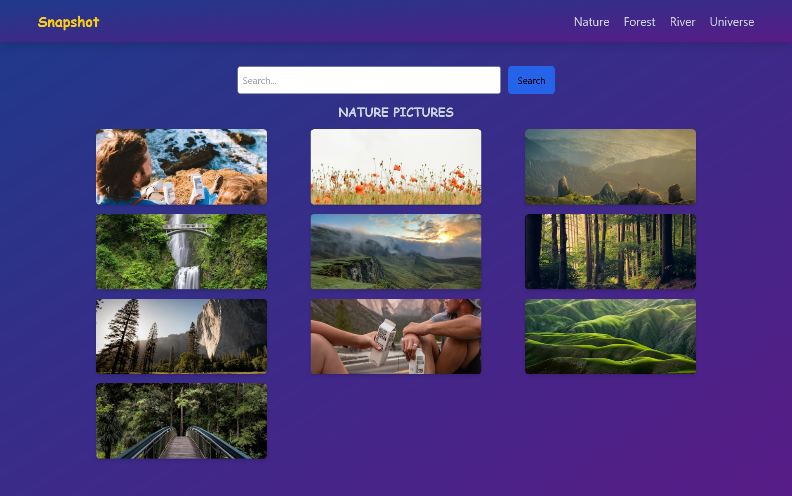

# Snap Shot

[Demo of Snap Shot](https://yoursnap.netlify.app/)

### Summary

SnapShot is a gallery created using React,React Hooks, React Router and Redux toolkit. The Routes were setup for four default pages and a search page. Also the images were displayed using the Unsplash API and fetch API to fetch data.

### Motivation

The purpose of this project was to get familiar with React Hooks and Redux toolkit.

### Getting Started

Click the demo link or clone/download the repository on your local machine.
Create a .env file in your root folder and add api key
export const VITE_ACCESS_KEY= your unsplash access key

##### Install dependencies

`npm install`

##### Run Snap Shot from the root directory.

`npm run dev`

### Built With

- React js
- React Router
- React Hooks
- Redux Toolkit
- Unsplash API

### Features

**1. Responsive Design.**

**2. Search functionality added to search photos from API.**

**2. Error Handling for various scenarios**

### Contributing

Everyone is welcomed to contribute to this project. You can contribute either by submitting bugs or suggesting improvements by opening an issue on GitHub.

This project was create using Vite.
